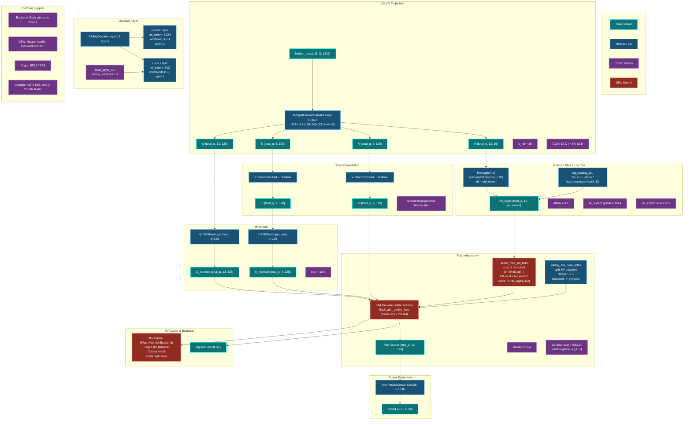

# Inkling FA4 Relative Attention Architecture

```mermaid
flowchart TB
    subgraph LEGEND[" "]
        direction LR
        L1[" Data Tensor "]:::dataNode
        L2[" Module / Op "]:::modNode
        L3[" Config Param "]:::cfgNode
        L4[" GPU Kernel "]:::kernNode
    end

    classDef dataNode fill:#0d7377,stroke:#14ffec,color:#fff,stroke-width:2px
    classDef modNode fill:#1a5276,stroke:#5dade2,color:#fff,stroke-width:2px
    classDef cfgNode fill:#6c3483,stroke:#bb8fce,color:#fff,stroke-width:2px
    classDef kernNode fill:#922b21,stroke:#f1948a,color:#fff,stroke-width:2px

    subgraph S1["QKVR Projection"]
        HS["hidden_states [B, S, 1536]"]:::dataNode
        QKVR["MergedColumnParallelLinear 1536->(128+128+128+16)x(12+4+4+12)"]:::modNode
        Q["Q [total_q, 12, 128]"]:::dataNode
        K["K [total_q, 4, 128]"]:::dataNode
        V["V [total_q, 4, 128]"]:::dataNode
        R["R [total_q, 12, 16]"]:::dataNode
        C1a["d_rel = 16"]:::cfgNode
        C1b["GQA: 12 Q / 4 KV (3:1)"]:::cfgNode
        HS --> QKVR
        QKVR --> Q & K & V & R
    end

    subgraph S2["Short Convolution"]
        KS["K ShortConv k=4 + residual"]:::modNode
        VS["V ShortConv k=4 + residual"]:::modNode
        K2["K' [total_q, 4, 128]"]:::dataNode
        V2["V' [total_q, 4, 128]"]:::dataNode
        C2["capture local patterns before attn"]:::cfgNode
        K --> KS --> K2
        V --> VS --> V2
    end

    subgraph S3["RMSNorm"]
        QN["Q RMSNorm per-head d=128"]:::modNode
        KN["K RMSNorm per-head d=128"]:::modNode
        QN2["Q_normed [total_q, 12, 128]"]:::dataNode
        KN2["K_normed [total_q, 4, 128]"]:::dataNode
        C3["eps = 1e-6"]:::cfgNode
        Q --> QN --> QN2
        K2 --> KN --> KN2
    end

    subgraph S4["Relative Bias + Log Tau"]
        RP["RelLogitsProj
 einsum(thd,de->the, r, W)
 16 -> rel_extent"]:::modNode
        LT["log_scaling_tau
 tau = 1 + alpha * log(clamp((pos+1)/nf, 1))"]:::modNode
        RL["rel_logits [total_q, 12, rel_extent]"]:::dataNode
        C4a["alpha = 0.1"]:::cfgNode
        C4b["rel_extent global = 1024"]:::cfgNode
        C4c["rel_extent local  = 512"]:::cfgNode
        R --> RP
        RP --> RL
        LT --> RL
    end

    subgraph S5["FlashAttention-4"]
        FA4["FA4 tile-wise online softmax
 flash_attn_varlen_func
 (CuTe DSL / tml-fa4)"]:::kernNode
        SM["score_mod_rel_bias
 cute.jit compiled
 d = (i+sk-sq) - j
 if 0 <= d < rel_extent:
   score += rel_logits[i,h,d]"]:::kernNode
        SK["inkling_fa4_num_splits
 split-KV adaptive
 Hopper -> 1
 Blackwell -> dynamic"]:::modNode
        AO["Attn Output [total_q, 12, 128]"]:::dataNode
        C5a["causal = True"]:::cfgNode
        C5b["window local = (511,0)
window global = (-1,-1)"]:::cfgNode

        QN2 --> FA4
        KN2 --> FA4
        V2 --> FA4
        RL --> SM
        SM --> FA4
        SK --> FA4
        FA4 --> AO
    end

    subgraph S6["Output Projection"]
        WO["RowParallelLinear 12x128 -> 1536"]:::modNode
        OUT["output [B, S, 1536]"]:::dataNode
        AO --> WO --> OUT
    end

    subgraph LYR["Decoder Layer"]
        DIR["InklingDecoderLayer 16 layers"]:::modNode
        GLB["Global Layer
 rel_extent=1024
 window=(-1,-1)
 split>=1"]:::modNode
        LOC["Local Layer
 rel_extent=512
 window=(511,0)
 split=1"]:::modNode
        CL["local_layer_ids
 sliding_window=512"]:::cfgNode
        DIR --> GLB
        DIR --> LOC
        CL --> LOC
    end

    subgraph KVC["KV Cache & Backend"]
        K2J["KV Cache (FlashAttentionBackend)
 Paged KV block=16
 Causal mask
 GQA replication"]:::kernNode
        LSE["log-sum-exp (LSE)"]:::dataNode
    end

    subgraph NOTE["Platform Support"]
        N1["Backend: flash_attn.cute BSD-3"]:::cfgNode
        N2["GPU: Hopper sm90 / Blackwell sm100+"]:::cfgNode
        N3["Dtype: BF16 / FP8"]:::cfgNode
        N4["Compile: CuTe DSL cute.jit 20-30x faster"]:::cfgNode
    end

    FA4 --> K2J
    FA4 --> LSE
```

> score_mod_rel_bias is the Inkling-specific relative bias injection point
> Compiled via CuTe DSL cute.jit, inlined into the FA4 kernel inner loop.
